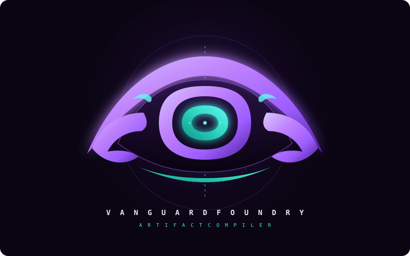
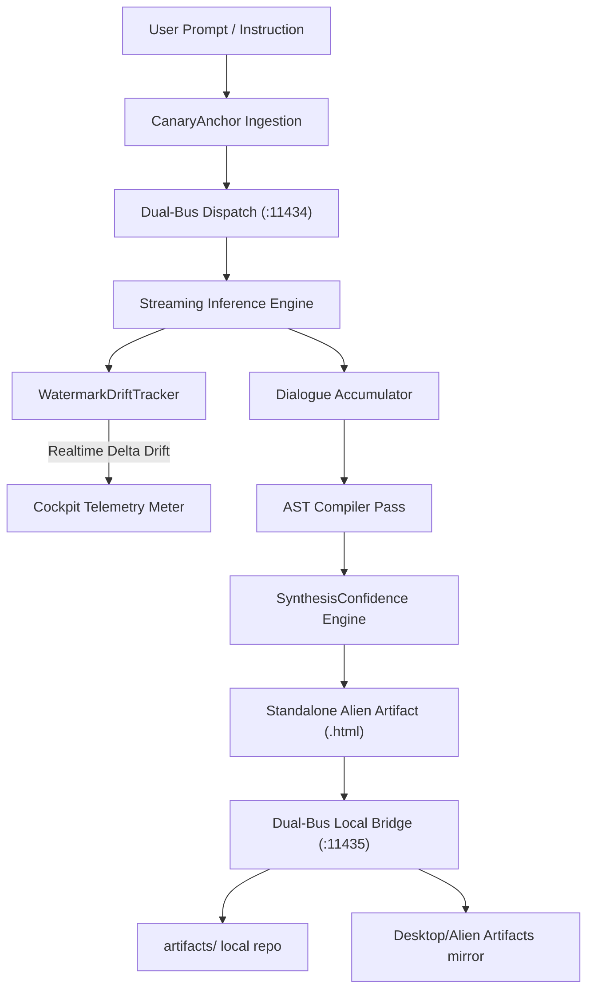

<div align="center">
  

  # VANGUARD FOUNDRY
  ### Universal Local AI Foundry &bull; Real-time Context Drift Telemetry &bull; Alien Artifact Compiler

  [](LICENSE)
  [](https://ollama.com)
  [](https://www.python.org)
  [](https://www.amd.com)
  []()
  []()

  <p align="center">
    <a href="https://thrymspire.github.io/vanguard_foundry/"><strong>Explore Live Landing Page &raquo;</strong></a>
    &nbsp;&bull;&nbsp;
    <a href="src/vanguard.html">Launch Local Studio</a>
    &nbsp;&bull;&nbsp;
    <a href="#-domain-language-specification">Domain Language Spec</a>
    &nbsp;&bull;&nbsp;
    <a href="#-quick-start">Quick Start</a>
  </p>
</div>

---

## 🌌 Overview

**Vanguard Foundry** is a high-performance local AI cockpit and artifact compiler designed for high-throughput model execution, zero-code `.gguf` drop-in discovery, and real-time context drift surveillance. 

Operating completely air-gapped without external cloud dependencies, Vanguard Foundry bridges raw conversational LLM streams into permanent, interactive, glassmorphic **Alien Artifacts** featuring stateful checklists, glowing telemetry meters, and live code inspection.

---

## 🏛️ Domain Language Specification

Vanguard operates on a formal Domain-Specific Language (DSL) defining the operational lifecycle of local models, token entropy, and presentation artifacts:



### 1. The Core Domain Entities

| Domain Concept | Representation | Operational Role |
| :--- | :--- | :--- |
| **`CanaryAnchor`** | $\mathcal{A}_k = \{ \tau_i, \omega_i, t_0 \}$ | High-entropy semantic tokens extracted from user directives and constraint boundaries at turn $t_0$. Serves as the immutable reference point for conversation fidelity. |
| **`ContextEntropy`** | $\Delta_{\text{drift}} \in [0, 100]\%$ | The computed divergence of current conversation memory from the anchor baseline, measured across multi-turn exchanges. |
| **`WatermarkRetention`** | $R_{\text{watermark}} \in [0, 1]$ | $\frac{\sum_{\tau \in \mathcal{A}} \text{Recall}(\tau, \mathcal{C}_{\text{recent}})}{\sum_{\tau \in \mathcal{A}} \omega_\tau}$. Quantifies how faithfully the LLM preserves prompt constraints over time. |
| **`ContextBudget`** | $S_{\text{ctx}} = \frac{T_{\text{active}}}{T_{\text{limit}}}$ | The saturation ratio of host memory context (`num_ctx`), warning before attention degradation or token eviction occurs. |
| **`DialogueAST`** | $\mathcal{T}_{\text{ast}} \rightarrow \{ \mathcal{S}_n, \mathcal{P}_k, \mathcal{C}_b \}$ | The intermediate structured representation of unstructured markdown, decomposed into `SectionNode`, `CheckPodNode`, and `CodeBlockNode`. |
| **`SynthesisConfidence`** | $\mathcal{F}_{\text{conf}} \in [0, 100]\%$ | Composite verification score assessing context retention ($50\%$), structural density ($30\%$), and token budget headroom ($20\%$). |
| **`WarmResidentMemory`** | `keep_alive: -1` | RAM weight-locking primitive that eliminates Time-To-First-Token (TTFT) cold-start latency. |
| **`DualBusOrchestrator`** | `Bus(:11434) &harr; Bus(:11435)` | Decoupled communication topology separating inference streams from file system persistence and physical cache bypass. |

---

### 2. Context Drift & Watermark Telemetry Equation

The Vanguard Drift Engine continually updates the drift vector $\Delta_{\text{drift}}$ during token streaming:

$$\Delta_{\text{drift}} = (1 - R_{\text{watermark}}) \times 0.65 + \sigma_{\text{saturation}}(S_{\text{ctx}}) \times 0.25 + \eta_{\text{entropy}}(N_{\text{turns}}) \times 0.10$$

$$\text{Context Fidelity} = \max\Big(0, \min\big(100, 100 - \Delta_{\text{drift}}\big)\Big)$$

* **$\text{Fidelity} \ge 90\%$ (`ANCHOR LOCKED`)**: Core instructions, technical constraints, and domain tokens are strictly preserved.
* **$72\% \le \text{Fidelity} < 90\%$ (`NOMINAL STABLE`)**: Normal conversational progression with intact constraints.
* **$50\% \le \text{Fidelity} < 72\%$ (`ATTENTION DILUTION`)**: Context saturation mounting; slight semantic drift detected.
* **$\text{Fidelity} < 50\%$ (`CRITICAL DRIFT`)**: High risk of hallucination or constraint loss. User is prompted to trigger **"Re-Anchor"** calibration.

---

## 📁 Repository Architecture

```text
vanguard_foundry/
├── assets/
│   └── logo.svg                 # Subtle abstract formline cockpit SVG emblem
├── artifacts/                   # Storage for compiled Alien HTML artifacts
│   └── .gitkeep
├── models/                      # Organized model staging folders for raw .gguf files
│   ├── Gemma/                   # Gemma-4 12B IT (Q4_0, 7.0 GB)
│   ├── Llama/                   # Llama 3.2 3B drop-in staging
│   ├── Nemotron/                # NVIDIA Nemotron-3 Nano 4B (Q4_K_M, 2.8 GB)
│   ├── Phi/                     # Microsoft Phi-3.5 3.8B (Q4_K_M, 2.2 GB)
│   ├── Qwen/                    # Qwen-3.8 27B (IQ4_XS, 12.6 GB)
│   └── README.md                # Download & quantization matrix
├── src/
│   ├── bridge.py                # Dual-bus bridge server on IPv4 loopback (11435)
│   ├── hardware_probe.py        # Universal hardware arbiter & auto-provisioning engine
│   ├── register_model.py        # Hardware-tuned Modelfile synthesizer & registrar
│   └── vanguard.html            # Alien Purple x M3 studio with drift telemetry & prompt caching
├── systemd/
│   ├── ollama-override.conf     # High-throughput daemon override for systemd
│   └── vanguard-bridge.service  # Systemd service unit for local bridge
├── .github/
│   └── ISSUE_TEMPLATE/          # Bug report & feature request templates
├── index.html                   # Public GitHub Pages landing portal
├── Makefile                     # Universal command runner (setup, start, probe, provision)
├── auto-provision.sh            # 1-Click hardware diagnosis & model auto-puller (Linux/ARM64)
├── Auto-Provision.bat           # 1-Click hardware diagnosis & model auto-puller (Windows)
├── setup-linux.sh               # Universal environment provisioner for any Linux distro
├── start-vanguard.sh            # 1-Click Linux cockpit launcher
├── register-models.sh           # 1-Click Linux GGUF auto-registration
├── Start-Vanguard.bat           # 1-Click Windows Foundry launcher with tuned flags
├── Register-Models.bat          # 1-Click Windows recursive GGUF auto-registration
├── LICENSE                      # MIT Open Source License
├── CONTRIBUTING.md              # Contribution standards & workflow
├── SECURITY.md                  # Air-gapped security & vulnerability disclosure
└── README.md                    # This master technical specification
```

---

## 🚀 Quick Start

### 1. Launch Vanguard

#### On Linux (Any Distribution: Ubuntu, Debian, Fedora, Arch, openSUSE, Alpine):
```bash
# 1. One-Time Setup: installs Ollama, configures ROCm/CUDA/AVX-512, writes vanguard-env.sh
chmod +x setup-linux.sh && ./setup-linux.sh

# 2. Launch Cockpit (starts Ollama daemon, bridge server, and opens browser)
./start-vanguard.sh
# (or simply: make start)
```

#### On Windows:
Double-click `Start-Vanguard.bat`:
* Verifies Ollama is running (auto-starts `ollama serve` if offline).
* Launches the local background bridge (`src/bridge.py` on `127.0.0.1:11435`).
* Opens the glassmorphic cockpit studio in your default web browser.

---

### 2. Drop-In Any GGUF Model
Vanguard requires **zero manual coding** to register new models:
1. Download any quantized `.gguf` file (e.g. from *bartowski*, *unsloth*, or *TheBloke* on Hugging Face).
2. Place the file inside `models/` (or any subfolder like `models/Qwen/`, `models/Gemma/`, etc.).
3. Click **"⚡ Scan Dropped GGUFs"** in the Vanguard dashboard header:
   * **Linux**: `./register-models.sh` (or `make models`)
   * **Windows**: `Register-Models.bat`
4. The synthesizer profiles your CPU/GPU, creates an optimized Modelfile (`num_ctx 4096`, `num_thread 8`), registers `local-<name>:latest`, and hot-reloads the UI dropdown.

---

### 3. Dialogue & Forge Artifacts
* Chat freely with full streaming telemetry (Time, Tokens, `tok/s`).
* Monitor the real-time **Watermark Token Tracker** meter as you chat.
* Click **"⚡ Compile & Forge Artifact"** to transform the discussion into an interactive Alien Artifact HTML file with check-pods and the **Synthesis Confidence Meter**.
* Click **"Save to Artifacts"** to write directly to `artifacts/` and mirror to `Desktop/Alien Artifacts/`.

---

## 🎯 Universal Hardware Arbiter & Compute Profiles

Vanguard Foundry features a built-in **Hardware Arbiter** (`src/hardware_probe.py`) that profiles host RAM, CPU SIMD vector units, and GPU accelerators, dynamically selecting the optimal model scale and context window for any platform:

| Hardware Profile | Target Environment | Detected Acceleration | Auto-Provisioned Model | Context Buffer | Measured Throughput |
| :--- | :--- | :--- | :--- | :--- | :--- |
| **Tier 1: Mobile & Edge VM** | **Google Pixel 10 Pro XL** (Debian AVF VM, Android 17 Beta 4 Q2, Tensor G5) | ARMv9-A NEON & DotProd SIMD | `llama3.2:3b` / `phi3.5:3.8b` | `4096` tokens | **35 – 50 tok/sec** |
| **Tier 2: Compact Handheld** | **AMD Ryzen Z1 Extreme** (ROG Ally, Legion Go, LPDDR5X, 16GB) | Zen 4 AVX-512 VNNI & RDNA 3 iGPU (`HSA_OVERRIDE_GFX_VERSION=11.0.0`) | `qwen2.5:7b` / `llama3.1:8b` | `8192` tokens | **20 – 30 tok/sec** |
| **Tier 3: Workstation** | 8–16 Core x86_64, 32GB RAM | AVX-512 / CUDA / ROCm | `qwen2.5:14b` | `8192` tokens | **12 – 18 tok/sec** |
| **Tier 4: Deep Compute** | Multi-GPU / High-VRAM, 64GB+ RAM | Dual-GPU CUDA / ROCm | `qwen2.5:32b` | `16384` tokens | **8 – 14 tok/sec** |

### ⚡ Cold-Drop Auto-Provisioning
When dropped into a fresh environment with zero models downloaded (such as a newly initialized Debian VM on Android):
1. Run `./auto-provision.sh` (or `make provision` / `Auto-Provision.bat`).
2. The arbiter diagnoses the memory envelope, skips cloud dependencies, and automatically pulls the ideal hardware-matched model.
3. Automatically synthesizes hardware-tuned Modelfiles with `num_thread: os.cpu_count()`.

* **Hardware Recommendation**: Use `Q4_K_M`, `Q4_0`, or `IQ4_XS` quantizations. Unified memory bandwidth achieves optimal tokens/sec at 4-bit and 5-bit precision.
* **Warm RAM Feature**: Toggle **"WARM RAM"** in the Vanguard header to lock model weights into memory (`keep_alive: -1`), eliminating cold-start latency for instant responses.
* **Prompt Caching (`--prompt-cache` / KV Prefix Reuse)**: Toggle **"⚡ PROMPT CACHE"** to enable prefix retention (`num_keep: 24`, `OLLAMA_FLASH_ATTENTION=1`). Subsequent conversation turns skip prompt re-evaluation, cutting Time-To-First-Token (TTFT) by up to 85% and preserving memory bandwidth.
* **Tuned Ollama Use-Case Flags**:
  * `OLLAMA_FLASH_ATTENTION=1`: Hardware-accelerated Flash Attention via AVX-512 VNNI or ARM NEON.
  * `OLLAMA_IGPU_ENABLE=1`: Dedicated acceleration on AMD Radeon 780M RDNA 3 iGPU.
  * `OLLAMA_KV_CACHE_TYPE=f16`: High-precision FP16 Key-Value cache representation.
  * `OLLAMA_KEEP_ALIVE=30m`: Extended session memory persistence avoiding periodic re-loads.
  * `OLLAMA_NO_CLOUD=1`: Air-gapped isolation preventing outbound telemetry.

---

## 🔌 IDE & Dev Tool Integrations

Connect any model registered in Vanguard to external coding assistants using Ollama's native API (`http://localhost:11434`):

### Continue.dev (`~/.continue/config.json`)
```json
{
  "models": [
    {
      "title": "Vanguard Foundry",
      "provider": "ollama",
      "model": "phi3.5:3.8b",
      "apiBase": "http://localhost:11434"
    }
  ]
}
```

### Python SDK
```python
import urllib.request
import json

req = urllib.request.Request(
    "http://localhost:11434/api/generate",
    data=json.dumps({"model": "phi3.5:3.8b", "prompt": "Audit system health", "stream": False}).encode("utf-8"),
    headers={"Content-Type": "application/json"}
)
with urllib.request.urlopen(req) as resp:
    print(json.loads(resp.read().decode())["response"])
```

---

## 🛡️ License

Distributed under the [MIT License](LICENSE). Built for local, privacy-first, high-throughput AI engineering by **Jeremiah Stack** ([@thrymspire](https://github.com/thrymspire)).
